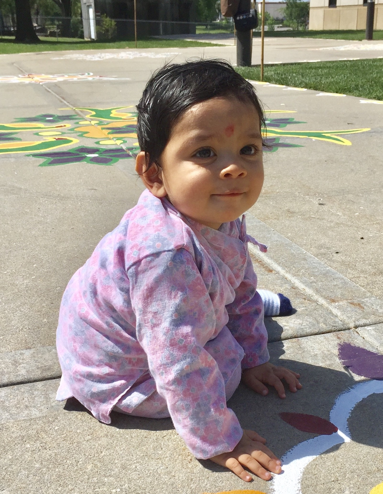

# All About Aayog Adhikari

  Hello! My name is Aayog Adhikari, and today, I am going to tell you guys all about me.

## Where And When I Was Born

  I was born in Columbia, Missouri, at around 4:00 AM in the morning. At that time, my grandma had come to the US to see me for the first time. She was very excited to meet me. Also, my mom was 25 years old, my dad was 31, and my grandma was 45 years old. I was also born at Mercy Hospital.

## When I Was 1 Year Old  
  
  At this time, it was May 9, 2017 to May 9, 2018. At the beginning of 2018, I had started eating chocolate. And in mid-2017, I went to a Nepali festival where I was given a necklace made of flowers, and it had a long piece of thread on the inside. My mom took many photos of us and one of them showed me on a concrete road. Here's what it looks like:

## When I Was 2 Years Old

  This time was May 9, 2018 to May 9, 2019. Nothing special really happened, although I went to Day-Care and every day, at the end of the day, our parents would come and watch videos with us. They would also get together to play toys with their child or children. It was fun and interesting for me.

## When I Was 3 Years Old

  This was May 9, 2019 to May 9, 2020. Lots of things happened when I was 3 years old. We moved to a city called St. Louis, and we had a lot of fun there, too. When it was snowing outside in November, I was so excited that I put on my winter clothes and stepped outside. Despite the coldness, I was also excited when I got to play in the snow for quite some time. 

## When I Was 4 Years Old

  
